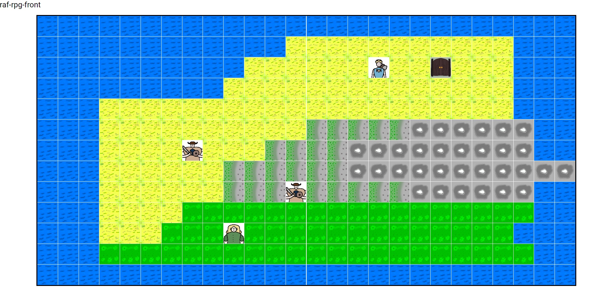
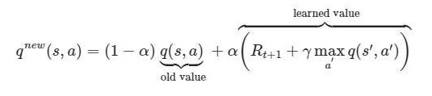
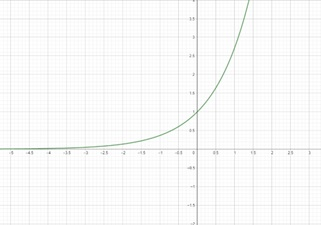
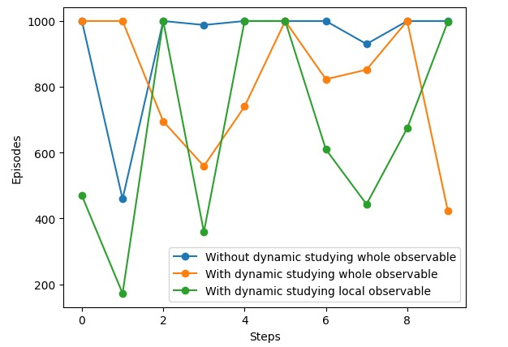

# Reinforcement-learning-agent-RAF-Deep-RPG
A Reinforcement learning agent based on Q-learning that plays RAF-Deep-RPG 2D game.

The game (frontend and backend) was written by Milan Bojić. You can find his github here: https://github.com/MilanBojic1999  
The backend and frontend are in this repository but also you can find them on the following: 
The backend is available at: https://github.com/MilanBojic1999/greed_island 
The frontend is available at: https://github.com/MilanBojic1999/raf-rpg-front 

# How to run
Download greed_island-master that is the backend for the game server, raf-rpg-front-master is the frontend and rl_player_raf_rpg.py is the actual RL agent. 
Go to the greed_island-master folder through the terminal and run  
java -jar greed_island-0.0.1-SNAPSHOT.jar --server.port=8080  
the spring server should start running. Next go to the raf-rpg-front-master folder through the terminal and run  
ng serve --host 0.0.0.0 --disable-host-check  
If you're having problems with this command I found the following quick fixes:  
On Unix like OS's (Linux, Mac...): export NODE_OPTIONS=--openssl-legacy-provider  
On Windows: set NODE_OPTIONS=--openssl-legacy-provider  
The frontend takes a bit to load up. Next go to your browser to localhost:4200 and you should see something like this. 

And finally to make the agent play the game open another cmd in the folder that contains rl_player_raf_rpg.py, and run it using  
python rl_player_raf_rpg.py  
You should see the player moving. The agent will play 10 episodes (maps). He can either succeed withing 1000 moves or he will restart the map. 

# Design
The model was created using Q-learning with Bellmans optimality formula.

Later we changed the learning and discount rate to change dynamically (lower during training) because at the beginning the agent doesn't know anything 
about the environment so it's better to explore more, drastically change q-table values and prioritize future rewads. Later as the agent learns its better 
to lower these values so that the agent choses optimal solutions and changes the q-table less. For this change we used the exponent function:

# Experiments
We firstly made the model so that it can observe the whole map. It wasn't very efficient, we had 3 out of 10 wins with average of 800 steps per episode win. 
Later when we added the adaptive changing of the learning and discount rate we acquired better results, 6 out of 10 wins with average of 680 steps per win and 
30% win rate on 100 episodes. When we changed the observe space to local (the agent has states based only on what is up, down, left, right from him), we 
noticed an improvement. We obtained 7 out of 10 wins with 530 steps per episode win and 38% win rate on 100 episodes. The last result of the agent without training, 
just using the q-table we trained with changing in the exploration/exploitation rate, we acquired 6 out of 10 wins with average 490 steps per episode win. 
These are the comparisons of the results compared: 

